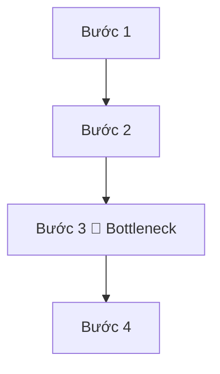

# Sơ đồ trực quan hóa quy trình vận hành hiện tại (Workflow Diagram)

Dưới đây là một sơ đồ mẫu sử dụng Mermaid. Bạn có thể sử dụng Preview của VS Code (hoặc extension) để xem sơ đồ này và chụp ảnh lưu lại thành file `.png`.

